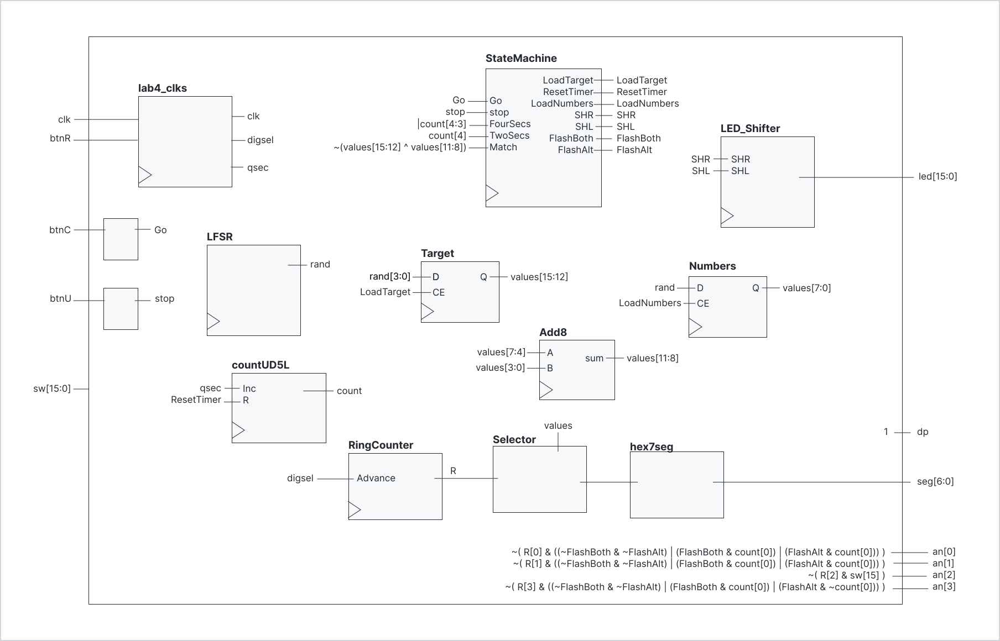

# Lab 4 Writeup
- James Tennant
- 4 November 2022
- Section A

## Description

For Lab 4 I created a single-player game called *Quick Add*.
This game is played on the Basys3 board.

To start the game, the player presses `btnC`. The player is then presented with:

- a target sum
- two random hex values

The random hex values are randomized every two seconds until the player presses `btnU`.

If the player presses `btnU` when the sum of the pair of digits (modulo 16) matches the target, then the player gains a point. If the sum does not match the target, the player loses a point. The player's goal is to gain as many points as possible.

## Design

<table>
<tr>
<th>Component</th><th>Description</th>
</td>
</tr>
<tr>
<td>top_lab4</td>
<td>

This is the only component with access to external inputs (`clkin, btnC, sw[15], etc.`) and external outputs (`led, seg, an, etc.`). This top-level component is responsible for managing and connecting all of the other subcomponents. For example, the random hex values are added with `Add8` and compared to the target sum to determine the value of match. Also, `an[3:0]` is set with respect to the output of `RingCounter` and `FlashBoth` and `FlashAlt`. For all other details see the full top-level diagram below.

</td>
</tr>
<tr>
<td>StateMachine</td>
<td>

Keeps track of which phase the game is in: `IDLE`, `WAIT`, `RIGHT`, `WRONG`. The `Go` input transitions from `IDLE` to `WAIT`. The `Match` signal is used to determine whether to transition to `RIGHT` or `WRONG`, and therefore set either `FlashAlt` or `FlashBoth` to high respectivley. See the appendix below for the complete state diagram and one-hot encoding equations.

</td>
</tr>
<tr>
<td>LFSR</td>
<td>

Linear Feedback Shift Register (`LFSR`) rapidly iterates through a sequence of all 255 non-zero values then repeats. An 8-bit random number is given by reading the components output at a random time. `LFSR` can be implemented with nothing but a shift register where the input to the first register $\text{D[0]}$ is a function of outputs of other specific registers: $$\text{D[0]} = \text{rnd[0]} \oplus \text{rnd[5]} \oplus \text{rnd[6]} \oplus \text{rnd[6]}$$

</td>
</tr>
<tr>
<td>LED_Shifter</td>
<td>

`LED_Shifter` is nothing but a 15-bit shift register tasked with keeping track of the player's points. Let $D$ be the input and $Q$ be the output of a bus of 15 flip-flops. Then:
- If `~SHL & ~SHR` then $D = Q$
- If `SHL & ~SHR` then $D = \{Q[14:0],1\}$
- If `~SHL & SHR` then $D = \{0,Q[15:1]\}$
- If `SHL & SHR` then $D$ is undefined (this should never happen)

</td>
</tr>
<tr>
<td>lab4_clks</td>
<td>

Provided. Generates `qsec` and `digsel` and `clk`.

</td>
</tr>
<tr><td>countUD5L</td><td>Taken directly from Lab 3.</td></tr>
<tr><td>RingCounter</td><td>Taken directly from Lab 2.</td></tr>
<tr><td>Selector</td><td>Taken directly from Lab 2.</td></tr>
<tr><td>hex7seg</td><td>Taken directly from Lab 2.</td></tr>
<tr><td>Add8</td><td>Taken directly from Lab 2.</td></tr>
<table>

## Testing & Simulation
Before anything else, I spent much time coming up with my state diagram for `StateMachine`. I went through several iterations of my state diagram, but was very satisfied with my final version. Then, using one-hot encoding, I carefully implemented `StateMachine`. Then I simulated `StateMachine` with all the cases I could think of, and to my suprise, *everything worked as expected, first try, without any adjustments at all*. Even though I ultimatley did not change anything, I was glad to confirm that my StateMachine appeared to have nearly perfect functionality. At the top level, through simulating I discovered that my original logic for setting `Match` was flawed — I was using the negation operator `~` as if it were a reduction operator.

## Results
> Include your state diagram, next state and output logic equations. The diagram can be hand drawn or drawn using with a program(aka app).

See appendix for my state diagram, next state and output logic equations.

> Describe each state of your machine in words. Example: "The machine is in state FLASH_B while after the player matched the target and it stays in this state until 4 seconds has elapsed."

- The machine is in state `IDLE` initially, and after either of the four-second flashing sequences completes, and it stays in this state until the player presses `btnC`.
- The machine is in state `GUESS` after the pkayer has started the game by pressing `btnC` and stays there until the player presses `btnU`.
- The machine is in state `RIGHT` after the player matched the target and it stays in this state until 4 seconds has elapsed.
- The machine is in state `WRONG` after the player failed to match the target and it stays in this state until 4 seconds has elapsed.

## Conclusion
Compared to previous labs, this lab allowed for more creative liberty. There were many different ways to build this lab, and none of them were obviously the "right" or best way. Therefore I really had to make executive decisions and come up with my own logic, without following a predefined path.

This lab went very smoothley, didn't take very long, and was not very painful. I am grateful to have not encountered hardly any bugs or obstacles. I wouldn't do anything differently if I were to do it over again.

## Appendix

*My original state diagram, next state logic equations (using one-hot encoding), and output logic equations.*

